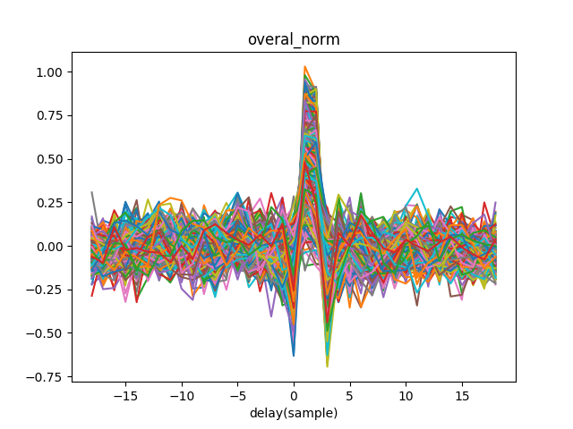

## GCC-PHAT based DNN localization method
Baseline system in *END-TO-END BINAURAL SOUND LOCALISATION FROM THE RAW WAVEFORM*[^Vecchiotti_2019]

## Framework

## Dataset
  Binaural signal are synthesized using BRIRs.

  - BRIRs

    Surrey binaural room impulse response (BRIR) database, including anechoic room and 4 reverberation room.
    <table style='text-align:center'>
    <tr>
      <td>Room</td> <td>A</td> <td>B</td> <td>C</td> <td>D</td>
    </tr>
    <tr>
      <td>RT_60(s)</td> <td>0.32</td> <td>0.47</td> <td>0.68</td> <td>0.89</td>
    </tr>
    <tr>
      <td>DDR(dB)</td> <td>6.09</td> <td>5.31</td> <td>8.82</td> <td>6.12</td>
    </tr>
    </table>

  - Sound source

    TIMIT sentences

    Sentences per azimuth
    <table style='text-align:center'>
    <col width=15%>
    <col width=15%>
    <col width=15%>
      <tr>
        <td>Train</td> <td>Validate</td> <td>Evaluate</td>
      </tr>
      <tr>
        <td>24</td> <td>6</td> <td>15</td>
      </tr>
    </table>

## Cue extractor

  Normally, features are normalized before being fed into network.  If each dimension of features is independent variable, then normalization is applied to each dimension separately. For GCC-PHAT, what matters is the peak position, in other words, the relative value of each dimension, the same normalization coefficient should be used.

  Two types of normalization are tested here:
  -  **separate_norm**: each dimension is normalized separately
  -  **overall_norm**: all dimensions are normalized with the same factor

  E.g.
| separate_norm  | overall_norm |
|-|-|
|  |  |

## Model training

### Multi-conditional training(MCT)

Each time, 1 reverberant room was selected and using in evaluation, the other 3 reverberant rooms and the anechoic room were used in model training. 
  <table>
    <tr>
      <th>separate_norm</th> <th>overall_norm</th>
    </tr>
    <tr>
      <th>  </th> <th>  </th>
    </tr>
  </table>

### Evaluation

  Localization result was reported every 25 frames, considering the existence of silent frames. The RMSE of sound azimuth is used as performance metrics. For more stable result, evaluation is ran on 4 different test sets and RMSEs are averaged (not in the ref. paper).

   

    <table style="text-align:center">
      <col width=20%>
      <col width=20%>
      <col width=20%>
      <col width=20%>
      <col width=20%>
      <thead>
        <tr>
          <th></th>
          <th>A</th>
          <th>B</th>
          <th>C</th>
          <th>D</th>
        </tr>
      </thead>
    <tbody>
      <tr>
        <td> Paper </td><td>2.7</td><td>3.3</td><td>3.1</td><td>5.2</td>
      </tr>
      <tr>
        <td>Separate_norm</td><td><strong>0.5</strong></td><td><strong>1.6</strong></td><td><strong>1.1</strong></td><td><strong>3.3</strong></td>
      </tr>
      <tr>
        <td>overall_norm</td><td>0.6</td><td>1.7</td><td>1.1</td><td>3.3</td>
      </tr>
    </tbody>
    </table>
    

### Stability of model training

For room D, model is trained 3 times. Even though similar losses are achieved, test results vary.

mean:  3.39	std: 0.07

s

## Main Dependencies
  - python 3
  - tensorflow-1.14
  - pysofa <https://github.com/bingo-todd/pySOFA>
  - BasicTools <https://github.com/bingo-todd/BasicTools>

## Generate dataset
  1. Align BRIRs(Not necessary)

     Align BRIRs of reverberant rooms to BRIRs of anechoic room.

  2. Synthesize spatial recordings
  3. Calculate GCC-PHAT features
  4. Calculate normalization coefficients of GCC-PHAT features

## Reference
[^Vecchiotti_2019]: Vecchiotti, Paolo, Ning Ma, Stefano Squartini, and Guy J. Brown. “END-TO-END BINAURAL SOUND LOCALISATION FROM THE RAW WAVEFORM.” In 2019 IEEE INTERNATIONAL CONFERENCE ON ACOUSTICS, SPEECH AND SIGNAL PROCESSING (ICASSP), 451–55. International Conference on Acoustics Speech and Signal Processing ICASSP. 345 E 47TH ST, NEW YORK, NY 10017 USA: IEEE, 2019.
