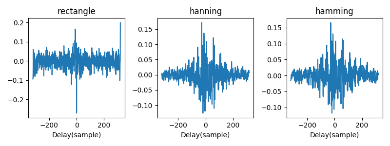
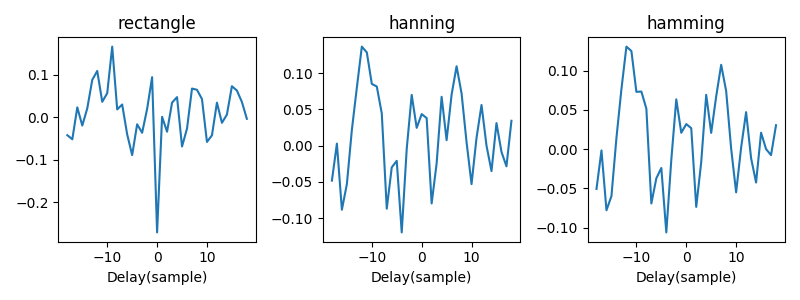
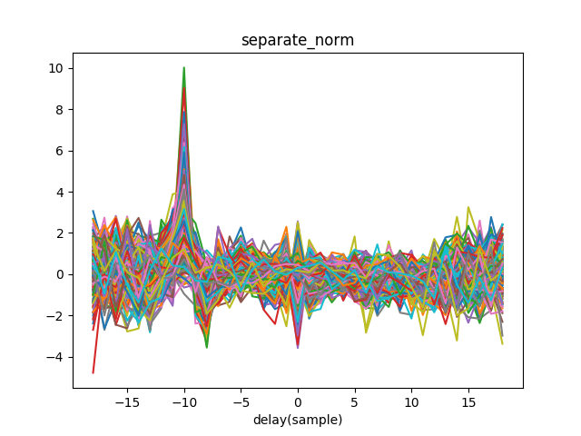
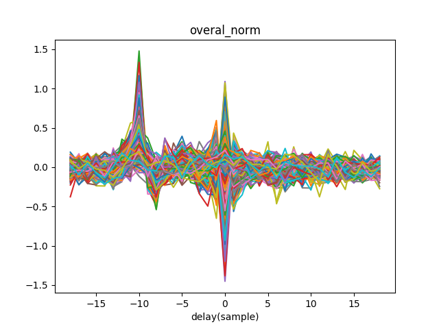
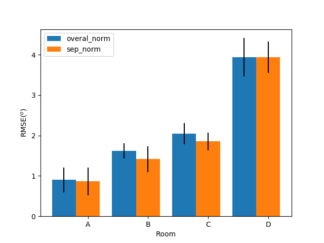

## GCC-PHAT based DNN localization method
baseline system in *END-TO-END BINAURAL SOUND LOCALISATION FROM THE RAW WAVEFORM*[^Vecchiotti_2019]

### The influence of windows in GCC-PHAT
  

when limiting delay within [-18,18] samples, difference may be litle
  

### normalization

  The DNN model takes GCC-PHAT as input feature, feature need to be amplitude normalized before feeding into DNN. There are two types of normalization basing on whether features are considered as whole or not:
  -  **Separate normalization**: each dimension is normalized separately
  -  **Overall normalization**: all dimensions are normalized with the same factor

E.g. (sound source is located in the left)

  | separate_norm  | overall_norm |
  |-|-|-|
  |  |  |

  For GCC-PHAT, the location information is implied in relative amplitude relation, it is overall normalization that make sense.

### Performance

In paper(Vecchiotti et al., 2019), localization result was reported every 25 frames, which was called 1 chunk. Since DNN outputs the posterior of sound azimuth, in 1 chunk, DNN outputs are averaged across frames, the final sound located by maximizing.

Evaluation results are not stable across trials, so evluations are performed 4 times using separate test dataset.

 Mean RMSE is listed as bellow:
  <table align=center>
    <thead>
      <tr>
        <th></th>
        <th>method</th>
        <th>A</th>
        <th>B</th>
        <th>C</th>
        <th>D</th>
      </tr>
    </thead>
  <tbody>
    <tr>
      <td rowspan=3> RMSE </td>
      <td>baseline in [^Vecchiotti_2019] </td><td>2.7</td><td>3.3</td><td>3.1</td><td>5.2</td>
    </tr>
    <tr>
      <td>separate_norm</td><td><strong>0.86</strong></td><td><strong>1.41</strong></td><td><strong>1.85</strong></td><td><strong>3.94</strong></td>
    </tr>
    <tr>
      <td>overal_norm</td><td>0.90</td><td>1.61</td><td>2.04</td><td>3.94</td>
    </tr>
  </tbody>
  </table>

  

 **Separate_norm actually outperform overall_norm**, which is not expected.

## Reference
[^Vecchiotti_2019]: Vecchiotti, Paolo, Ning Ma, Stefano Squartini, and Guy J. Brown. “END-TO-END BINAURAL SOUND LOCALISATION FROM THE RAW WAVEFORM.” In 2019 IEEE INTERNATIONAL CONFERENCE ON ACOUSTICS, SPEECH AND SIGNAL PROCESSING (ICASSP), 451–55. International Conference on Acoustics Speech and Signal Processing ICASSP. 345 E 47TH ST, NEW YORK, NY 10017 USA: IEEE, 2019.
